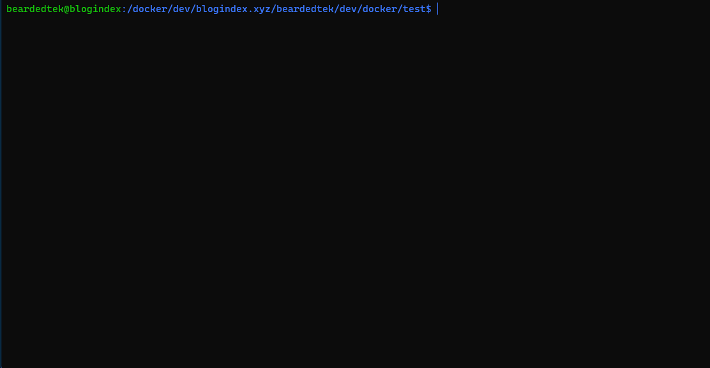

# Automated Testing with PyTest

In order to have a consistent test environment, all testing should be done in docker.

Please see [dev/docker/test](dev/docker/test) for a [docker-compose.yml](dev/docker/test/docker-compose.yml) to run an automated test using postgresql 15 and python 3.11

## Usage:
```
docker compose build
docker compose up
```
### *Note:*
If running an older version of docker, you may need to issue the commands as follows:
```
docker-compose build
docker-compose up
```

## How does it work?
- Starts postgresql database is apidb container
- Runs a modified python-3.11 container:
    - Executes the bash script [dev/docker/test/test](dev/docker/test/test) which takes the following actions:
    - deletes any existing .test virtual environment
    - stands up a .test virtual environment
    - runs pytest


Upon Completion it will tell you the results.  From here hit `ctrl-C` and type `docker compose down`

## Demonstration:
#### *NOTE: This GIF is sped up for clarity*
